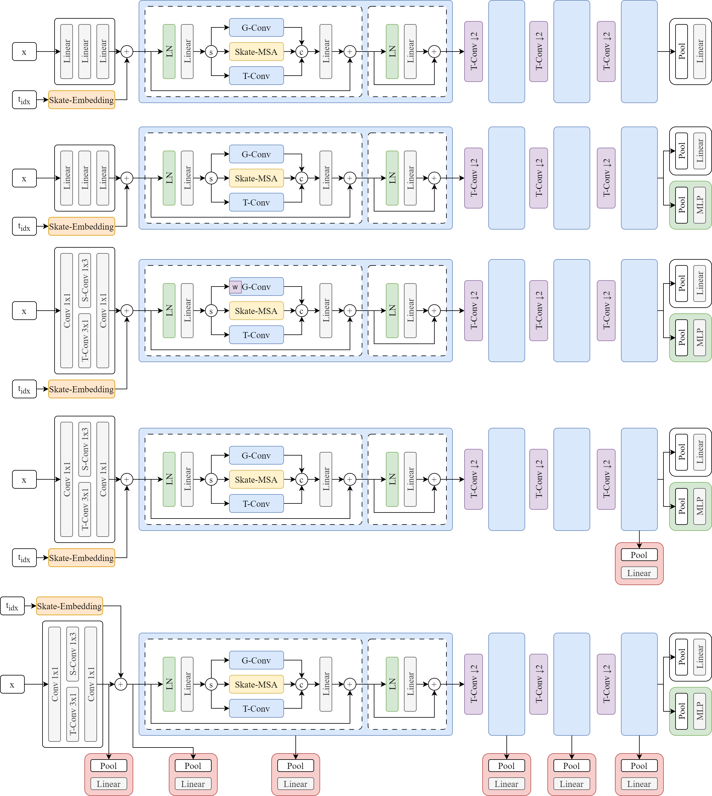
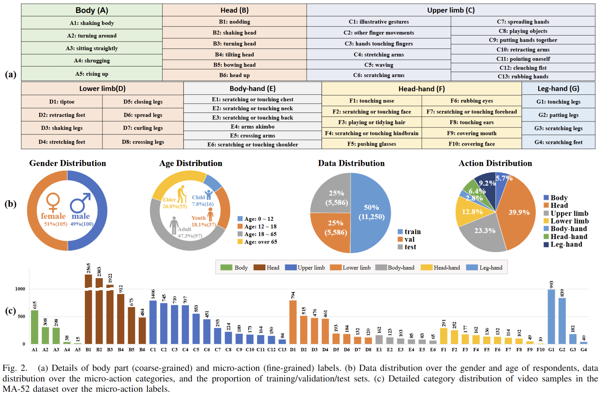

# MAR
**Medical Dermatology Research on LLM-Based Question-Answering**, 12/2024 - present

_Researcher_

- Divided skeletal-temporal relationships into four types and applied partition-specific self-attention for each type, focusing on efficiently capturing fine-grained skeletal-temporal correlations to optimize micro-action recognition algorithms, enhancing their accuracy and computational efficiency.
- Exploring an Adapter-based model tuning approach to replace the traditional Fine-tuning paradigm, aiming to reduce parameter update costs and enhance the efficiency of transfer learning from images to videos in large-scale models.

## Structure

## Datasets

